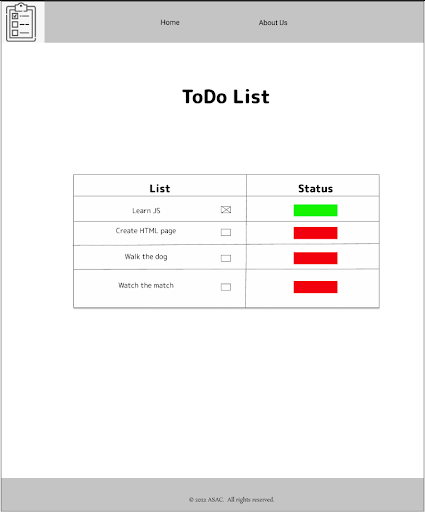
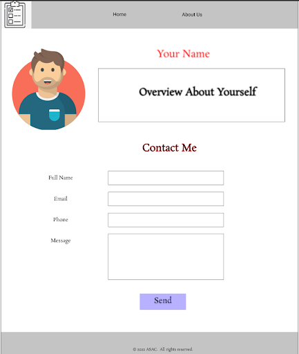

# Task 04:

## Overview:
Today will continue working on the Todo website

## Problem Domain:
You are building a ToDo List Web Application, where the Users can display their tasks and check the status for each one.

## Requirements:

1. **Set up your Github Repository:**
   - Continue working on the same `todo-project` repo.
   - Checkout a new branch called `todo-style` for today's task.
   - Open it in VS code.

2. **Style your app:**
   In this task, it is your job to style the website to be attractive as much as you can, the final result should at least match the preview below.
   1. **Home Page:**
   
      

   2. **About Page:**
   
      

## Submission Instructions:
- When your work is complete and ready for submission, push to the `todo-style` branch.
- Create a pull request
- Deploy to the Github pages.
- Submit the pull request and deployed version (Live URL) links.
- Merge `todo-style` with the main branch
- What observations or questions do you have about what you’ve learned so far?
- How long did it take you to complete this assignment? And, before you started, how long did you think it would take you to complete this assignment?